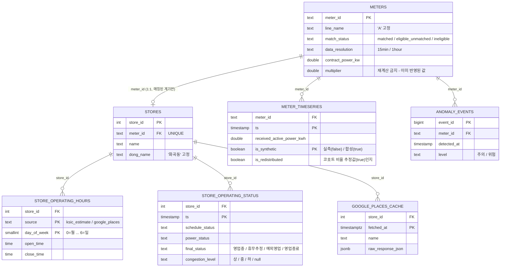

# AMI-상가 매칭 DB 스키마 문서

> 이 문서는 [`db/sql/schema.sql`](../sql/schema.sql)을 사람이 읽기 쉽게 정리한 것입니다.
> **스키마(DDL)를 고치면 이 문서도 같이 손으로 갱신하세요** — `API_REFERENCE.md`와 달리 자동 생성 스크립트가 없습니다.
>
> 대상 DB: PostgreSQL 16 (`contest_db`, Docker `places-api-project/docker-compose.yml`) · 스코프: A선로 64개 계기 전체 · 화곡동 파일럿(실매칭 ~21개)
> 웹으로 보기 편한 버전(같은 내용 + ERD 다이어그램)도 있습니다 → `SCHEMA.html` 또는 팀에 공유된 링크 참고.

## 목차

- [핵심 요약](#핵심-요약)
- [ERD (테이블 관계도)](#erd-테이블-관계도)
- [조인키 레퍼런스](#조인키-레퍼런스)
- [테이블별 상세](#테이블별-상세)
  1. [meters](#1-meters--계기-마스터)
  2. [meter_timeseries](#2-meter_timeseries--15분-시계열)
  3. [stores](#3-stores--화곡동-재매칭-결과)
  4. [store_operating_hours](#4-store_operating_hours--운영시간)
  5. [store_operating_status](#5-store_operating_status--운영상태-판정-결과)
  6. [anomaly_events](#6-anomaly_events--안전감지-이상치)
  7. [google_places_cache](#7-google_places_cache--google-places-원본-캐시)

---

## 핵심 요약

이 DB는 **A선로(먹자골목·사무실 밀집형, 상업용 87.5%) AMI 15분 전력 시계열**을 **화곡동 실제 상가 정보**와 업종코드(KSIC) 기준으로 통계적 근사 매칭시켜, `data/프로젝트개요.md`의 개발우선순위 1번(영업유무·혼잡도)과 2번(안전감지)을 판정하기 위한 것입니다.

**스코프가 테이블마다 다르다는 점이 이 스키마를 읽을 때 가장 헷갈리는 부분입니다:**

| 스코프 | 대상 | 해당 테이블 |
|---|---|---|
| A선로 전체 | 64개 계기 (매칭 성공 여부 무관) | `meters` |
| 화곡동 실매칭 | 약 21개 계기 (`meters.match_status = 'matched'`) | `meter_timeseries`, `stores`, `store_operating_hours`, `store_operating_status`, `anomaly_events`, `google_places_cache` |

나머지 43개 계기(고압 대형 건물·관공서 16개 포함)는 상가 매칭 자체가 불가능하거나(비상업용/특고압), 화곡동에 업종코드가 일치하는 상가 후보가 없어서 매칭되지 않았습니다 — `meters.match_status`가 그 이유(`eligible_unmatched` vs `ineligible`)까지 구분해서 보여줍니다.

### 테이블 한눈에 보기

| 테이블 | 목적 | PK | 주요 FK |
|---|---|---|---|
| `meters` | 계기 마스터 (A선로 전체 64개) | `meter_id` | – |
| `meter_timeseries` | 15분 단위 전력 시계열 (실측+합성) | `(meter_id, ts)` | `meter_id → meters` |
| `stores` | 계기↔상가 매칭 결과 (1:1) | `store_id` | `meter_id → meters` (UNIQUE) |
| `store_operating_hours` | 요일별 운영시간 (추정치+실측 공존) | `(store_id, source, day_of_week)` | `store_id → stores` |
| `store_operating_status` | 15분 슬롯별 영업유무/혼잡도 판정 | `(store_id, ts)` | `store_id → stores` |
| `anomaly_events` | 안전감지 이상치 이벤트 | `event_id` | `meter_id → meters` |
| `google_places_cache` | Google Places 응답 원문 캐시 | `(store_id, fetched_at)` | `store_id → stores` |

### 설계 원칙 (알고 있으면 스키마가 훨씬 이해가 쉬움)

- **ENUM 대신 CHECK 제약을 씀.** 공모전 데모 특성상 상태 라벨이 발표 준비 중 바뀔 가능성이 높은데, CHECK는 `ALTER TABLE ... DROP/ADD CONSTRAINT` 한 번으로 값 목록을 바꿀 수 있고 pandas/psycopg2 적재 시 커스텀 타입 어댑터도 필요 없습니다.
- **`meters.multiplier`(배수)는 계산에 재사용하지 않습니다.** `meter_timeseries`의 kWh 값에는 이미 배수가 반영된 최종값이 들어있어서, 여기에 배수를 다시 곱하면 값이 틀어집니다. 이 컬럼은 규모 참고용/정합성 검증용으로만 보관합니다.
- **`stores.match_note`에 매칭 방식의 한계를 데이터 자체에 박아둠.** 업종코드 기반 통계적 근사 매칭이며 실제 매장 확인 매칭이 아니고, 동(화곡동)도 데모 일관성을 위해 임의 지정된 것이라 AMI 데이터의 실제 위치가 아니라는 고지입니다(AMI 원본에는 주소/좌표 필드 자체가 없음). UI/발표 자료에서 "실제 매장 위치"로 오인되지 않게 하는 안전장치입니다.
- **`is_synthetic`이 실측/합성 분기의 유일한 기준.** `meter_timeseries`/`store_operating_status`는 `2026-04-01~06-30`이 실측(`is_synthetic=false`), `2026-07-01~오늘`이 합성(`is_synthetic=true`)입니다. 서빙 로직(`ami_db.serving`)은 날짜로 분기하는 코드가 전혀 없고 이 플래그를 그대로 읽어서 응답에 실어 보낼 뿐입니다.
- **`store_operating_hours`는 source별 이력을 지우지 않고 공존시킴.** PK가 `(store_id, source, day_of_week)`라서 `ksic_estimate`(잠정치)와 `google_places`(실측)가 같은 요일에 대해 동시에 존재할 수 있고, 조회 시엔 `google_places`를 우선합니다(`ami_db.status.load_effective_hours`).

---

## ERD (테이블 관계도)



> Mermaid ER 표기법은 복합 기본키를 필드마다 `PK`로만 표시할 수 있어 완전하지 않습니다. 정확한 복합키 구성은 바로 아래 [조인키 레퍼런스](#조인키-레퍼런스) 표를 기준으로 봐주세요.

### 이 스키마엔 "중계 테이블"(M:N 브릿지 테이블)이 없습니다

모든 관계가 **1:1**(`meters`↔`stores`, 매칭된 경우만) 또는 **1:N**(나머지 전부)입니다. 두 개의 독립된 엔티티를 연결하는 진짜 다대다 브릿지 테이블은 없습니다.

`store_operating_hours`가 복합키(`store_id, source, day_of_week`) 때문에 중계 테이블처럼 보일 수 있는데, 실제로는 "상가 하나가 (자료 출처 × 요일) 조합별로 운영시간 속성을 여러 개 가질 수 있다"는 **1:N 관계를 표현하는 속성 테이블**입니다 — `stores`와 다른 독립 엔티티를 잇는 게 아니라 `stores`의 이력형 확장 테이블에 가깝습니다.

---

## 조인키 레퍼런스

| # | 관계 | FK 컬럼 | 참조 대상 | ON DELETE | 카디널리티 | 비고 |
|---|---|---|---|---|---|---|
| 1 | 계기 → 상가 | `stores.meter_id` | `meters.meter_id` | CASCADE | 1:1 (optional) | `meter_id`에 `UNIQUE` 제약이 있어 계기 하나당 상가 최대 1개. `match_status='matched'`인 ~21개만 대응 행 존재 |
| 2 | 계기 → 시계열 | `meter_timeseries.meter_id` | `meters.meter_id` | CASCADE | 1:N | 계기 64개 중 실제 데이터가 있는 건 매칭된 ~21개뿐 |
| 3 | 계기 → 이상치 | `anomaly_events.meter_id` | `meters.meter_id` | CASCADE | 1:N | `store_id`가 아니라 `meter_id` 기준 — 이상치 탐지가 계기 원시값 레벨에서 이뤄지기 때문 |
| 4 | 상가 → 운영시간 | `store_operating_hours.store_id` | `stores.store_id` | CASCADE | 1:N | 상가 하나당 최대 14행 (source 2종 × 요일 7일) |
| 5 | 상가 → 운영상태 | `store_operating_status.store_id` | `stores.store_id` | CASCADE | 1:N | `meter_timeseries`와 동일 15분 그리드, 단 계기가 아닌 상가 기준 |
| 6 | 상가 → Places 캐시 | `google_places_cache.store_id` | `stores.store_id` | CASCADE | 1:N | 재호출 없이 재사용하려고 조회 시점(`fetched_at`)별 원문 보존 |

모든 FK가 `ON DELETE CASCADE`입니다 — `meters`나 `stores`에서 행을 지우면 그 계기/상가에 딸린 시계열·운영시간·상태·이상치·캐시가 전부 같이 지워집니다. 데모 재실행 시 재매칭 스크립트가 `TRUNCATE`/재적재를 하는 것도 이 전제 위에서 안전합니다.

---

## 테이블별 상세

### 1. `meters` — 계기 마스터

A선로 전체 64개 계기를 매칭 성공 여부와 무관하게 전부 적재합니다. `match_status`로 "매칭 안 된 계기가 왜 안 됐는지"까지 테이블 자체에서 드러나게 하려는 목적입니다.

| 컬럼 | 타입 | NULL | 설명 |
|---|---|:---:|---|
| `meter_id` | `TEXT` | PK | 예: `'A-L-58'`. 총괄표↔시계열 조인키 |
| `line_name` | `TEXT` | NOT NULL | 선로명. 이번 적재는 `'A'`만 대상 (근거: `data/03_지역특성_규모_업종_분석보고서.md`) |
| `section_no` | `TEXT` | ✓ | 구간번호. **배전선로상의 상대 위치 순번일 뿐 실제 지리 좌표가 아님** — "지역"으로 오인해 위치 추정에 쓰지 말 것 |
| `supply_type` | `TEXT` | ✓ | 공급방식 원문 (예: `'840 삼상4선(22.9kV-y)'`) |
| `contract_power_kw` | `DOUBLE PRECISION` | ✓ | 수전전력(kW, 계약전력). 매장매칭 스케일 배제 규칙(<50kW)의 기준값이자 혼잡도 이용률(%) 계산의 분모 |
| `contract_type` | `TEXT` | ✓ | 계약종별 원문 (요금 분석용, 영업유무/혼잡도 판정엔 직접 안 쓰임) |
| `usage_purpose` | `TEXT` | ✓ | 사용용도 원문(`'02 상업용'` 등) — 매장매칭 적격 판정의 1차 조건 |
| `multiplier` | `DOUBLE PRECISION` | ✓ | 배수(변성기 배수). **절대 재곱 금지** — `meter_timeseries`의 kWh 값에 이미 반영된 최종값. 규모 프록시/정합성 검증용으로만 보관 |
| `has_der` | `TEXT` | ✓ | 전기차/분산형 여부 원문 (대부분 공백, 드물게 `'PPA/태양광(299kW)'`) |
| `main_product` | `TEXT` | ✓ | 주생산품 원문 |
| `ksic_code` | `TEXT` | ✓ | 산업분류 원문(5자리 숫자 접두 + 한글 라벨, 예 `'68112 비주거용 건물 임대업'`) |
| `category_class` | `TEXT` | ✓ | 카테고리분류 (`02_match_store.py`의 `category_class()` 파생 로직과 동일) |
| `power_class` | `TEXT` | ✓ | 전력분류: 규모×전압 조합 (`02_match_store.py`의 `power_class()` 파생 로직과 동일) |
| `data_completeness` | `NUMERIC(5,2)` | ✓ | 실측 구간 결측률(%). `02_load_meta_and_timeseries.py`가 `timeseries_clean.pkl`의 실측 min~max 타임스탬프로 그리드 크기를 동적 계산해 A선로 64개 전체를 직접 재계산 (8,736 고정 분모 아님 — 아래 "data_resolution" 설명 참고) |
| `data_resolution` | `TEXT` | NOT NULL, 기본값 `'15min'` | CHECK: `15min` \| `1hour`. `1hour`이면 `received_active_power_kwh`가 매시 정각에만 존재하는 계기(아래 설명 참고) |
| `match_status` | `TEXT` | NOT NULL, 기본값 `'ineligible'` | CHECK: `matched` \| `eligible_unmatched` \| `ineligible` (아래 참고) |
| `created_at` | `TIMESTAMPTZ` | NOT NULL, 기본값 `now()` | 적재 시각 |

**`match_status` 허용값:**
- `matched` — 화곡동 상가와 실제 1:1 매칭됨 (`stores`에 대응 행 존재)
- `eligible_unmatched` — 매장매칭 적격(상업용/저압/<50kW)이었지만 화곡동에 KSIC 일치 후보가 없었거나, 같은 KSIC 코드를 공유하는 다른 계기에게 후보 풀이 먼저 소진됨
- `ineligible` — 애초에 매장매칭 부적격(비상업용/특고압/중규모 이상)

**인덱스:** PK(`meter_id`) 외 없음.

---

### 2. `meter_timeseries` — 15분 시계열

**스코프: 화곡동에 실제 매칭된 계기(`match_status='matched'`, 약 21개)로 한정.** 나머지 계기는 운영시간 정보가 없어 영업유무/혼잡도 판정 자체가 정의되지 않고, 스코프를 좁히면 데이터량이 21개 × 약 155일 × 96슬롯 ≈ 31만 행으로 가벼워져 반복 실행이 빨라집니다.

| 컬럼 | 타입 | NULL | 설명 |
|---|---|:---:|---|
| `meter_id` | `TEXT` | PK, FK → `meters.meter_id` | `ON DELETE CASCADE` |
| `ts` | `TIMESTAMP` | PK | 원본 AMI 시각(KST, tz 정보 없음) 그대로 — tz 변환 불필요 |
| `received_active_power_kwh` | `DOUBLE PRECISION` | ✓ | `recv_kWh`("유효전력"). 이미 배수 반영된 최종값 — 절대 재곱 금지 |
| `generated_active_power_kwh` | `DOUBLE PRECISION` | ✓ | `gen_kWh`. 대부분 NULL (전체 계기의 86.8%가 태양광 등 분산전원 없음) |
| `voltage_a` / `voltage_b` / `voltage_c` | `DOUBLE PRECISION` | ✓ | 상별 전압 |
| `current_a` / `current_b` / `current_c` | `DOUBLE PRECISION` | ✓ | 상별 전류 |
| `is_synthetic` | `BOOLEAN` | NOT NULL | `false`=실측(2026-04-01~06-30), `true`=합성(2026-07-01~오늘). 서빙 로직은 이 값만 읽어서 응답에 실어 보냄 — 날짜 분기 코드 없음 |
| `is_redistributed` | `BOOLEAN` | NOT NULL, 기본값 `FALSE` | `true`면 이 행의 `received_active_power_kwh`는 실측이 아니라 코호트 비율로 추정한 값(아래 "data_resolution/is_redistributed" 설명 참고). 지금은 `A-L-58` 한 계기만 해당 |

**PK:** `(meter_id, ts)`
**인덱스:** PK 자체가 "특정 계기의 날짜범위 조회"에 이미 최적 인덱스. `idx_meter_timeseries_ts ON (ts)` — "특정 시각의 전 매장 스냅샷"(혼잡도 대시보드용) 조회를 위해 추가.

---

### 3. `stores` — 화곡동 재매칭 결과

계기 1개 : 상가 1개, `02_match_store.py`와 동일한 무작위 비복원추출 규칙을 화곡동 범위로 재현한 결과입니다.

| 컬럼 | 타입 | NULL | 설명 |
|---|---|:---:|---|
| `store_id` | `SERIAL` | PK | |
| `meter_id` | `TEXT` | NOT NULL, UNIQUE, FK → `meters.meter_id` | `ON DELETE CASCADE`. UNIQUE라서 계기 하나당 상가 최대 1개 |
| `name` | `TEXT` | NOT NULL | 상호명 |
| `branch_name` | `TEXT` | ✓ | 지점명 (결측 다수) |
| `road_address` | `TEXT` | ✓ | 도로명주소 |
| `building_name` | `TEXT` | ✓ | 건물명 (원본 결측 다수) |
| `floor_info` | `TEXT` | ✓ | 층정보 (원본 결측 다수) |
| `longitude` / `latitude` | `DOUBLE PRECISION` | ✓ | 경도/위도. 원본 CSV엔 문자열로 들어있어 로더에서 CAST 필요 |
| `biz_category_large` | `TEXT` | ✓ | 상권업종대분류명 |
| `biz_category_mid` | `TEXT` | ✓ | 상권업종중분류명 |
| `ksic_code` | `TEXT` | ✓ | 표준산업분류코드 원문(알파벳 대분류 접두 포함, 예 `'I56111'`) |
| `dong_name` | `TEXT` | NOT NULL, 기본값 `'화곡동'` | 이번 파일럿의 단일 동 고정값. 법정동명 기준 (행정동명은 화곡1~8동으로 쪼개져 단일값이 아님) |
| `match_note` | `TEXT` | NOT NULL, 기본값 있음 | `'업종코드 기반 통계적 근사 매칭이며 실제 매장 확인 매칭이 아니고, 지역(동)도 데모 일관성을 위해 임의 지정된 것으로 AMI 데이터 자체의 실제 위치가 아님'` — AMI 원본에는 주소/좌표 필드가 전혀 없어서, UI/발표 자료에서 "실제 매장 위치"로 오인되지 않도록 데이터 자체에 박아둔 안전장치 |
| `created_at` | `TIMESTAMPTZ` | NOT NULL, 기본값 `now()` | |

**인덱스:** PK(`store_id`) + `meter_id` UNIQUE 인덱스 자동 생성. `idx_stores_dong_name ON (dong_name)`.

---

### 4. `store_operating_hours` — 운영시간

source별 이력을 보존합니다 — `google_places` 매칭이 성공해도 `ksic_estimate` 행은 지우지 않습니다. PK가 `(store_id, source, day_of_week)`라서 두 source가 같은 요일에 대해 자연스럽게 공존하고, "추정치인지 실측인지"는 `source` 컬럼만 보면 되므로 별도 플래그가 필요 없습니다.

| 컬럼 | 타입 | NULL | 설명 |
|---|---|:---:|---|
| `store_id` | `INTEGER` | PK, FK → `stores.store_id` | `ON DELETE CASCADE` |
| `source` | `TEXT` | PK | CHECK: `ksic_estimate` \| `google_places` |
| `day_of_week` | `SMALLINT` | PK | CHECK: 0~6 (0=월요일 ... 6=일요일) |
| `open_time` / `close_time` | `TIME` | ✓ | `is_closed=true`인 요일은 NULL 허용 |
| `is_closed` | `BOOLEAN` | NOT NULL, 기본값 `FALSE` | |
| `is_24h` | `BOOLEAN` | NOT NULL, 기본값 `FALSE` | `true`면 `open_time=00:00`/`close_time=23:59`로 채워 range 쿼리 편의성 확보 |
| `raw_hours_text` | `TEXT` | ✓ | `google_places` 원문 한 줄(예: `'월요일: 10:00 ~ 22:00'`). `ksic_estimate` 소스는 NULL |
| `fetched_at` | `TIMESTAMPTZ` | NOT NULL, 기본값 `now()` | |

**PK:** `(store_id, source, day_of_week)` — 추가 인덱스 없음.

**조회 시 우선순위:** `google_places`가 `ksic_estimate`보다 우선 (`ami_db.status.load_effective_hours`가 `DISTINCT ON (store_id, day_of_week) ... ORDER BY (source='google_places') DESC`로 처리).

---

### 5. `store_operating_status` — 운영상태 판정 결과

15분 슬롯마다 1행 — `meter_timeseries`와 동일 그리드를 상가 기준으로 재구성한 결과입니다.

| 컬럼 | 타입 | NULL | 설명 |
|---|---|:---:|---|
| `store_id` | `INTEGER` | PK, FK → `stores.store_id` | `ON DELETE CASCADE` |
| `ts` | `TIMESTAMP` | PK | `meter_timeseries.ts`와 동일 그리드 |
| `schedule_status` | `TEXT` | NOT NULL | CHECK: `open_hours` \| `closed_hours` — 조회 시각을 운영시간표(google_places 우선, 없으면 ksic_estimate)와 비교한 결과 |
| `power_status` | `TEXT` | NOT NULL | CHECK: `active` \| `low` — 해당 계기의 야간(0~5시) baseline 전력과 현재 전력을 비교한 결과 |
| `final_status` | `TEXT` | NOT NULL | CHECK: `영업중` \| `휴무추정` \| `예외영업` \| `영업종료` (판정 매트릭스는 아래 참고) |
| `congestion_level` | `TEXT` | ✓ | CHECK: `상` \| `중` \| `하`. `final_status`가 `영업중`이 아니면 혼잡도 자체가 무의미하므로 NULL 허용 |
| `computed_at` | `TIMESTAMPTZ` | NOT NULL, 기본값 `now()` | |

**`final_status` 판정 매트릭스** (`schedule_status` × `power_status`):

| | `power_status = active` | `power_status = low` |
|---|---|---|
| `schedule_status = open_hours` | **영업중** | **휴무추정** ← 프로젝트개요.md 핵심 케이스: "영업시간인데 전력량이 영업종료 시간과 같으면 영업 종료로 판단" |
| `schedule_status = closed_hours` | **예외영업** (심야영업 등) | **영업종료** |

**PK:** `(store_id, ts)`
**인덱스:** `idx_store_operating_status_ts ON (ts)` — 특정 시각의 전 매장 스냅샷 조회용.

---

### 6. `anomaly_events` — 안전감지 이상치 (2차 우선순위 기능)

| 컬럼 | 타입 | NULL | 설명 |
|---|---|:---:|---|
| `event_id` | `BIGSERIAL` | PK | |
| `meter_id` | `TEXT` | NOT NULL, FK → `meters.meter_id` | `ON DELETE CASCADE`. `store_id`가 아니라 `meter_id` 기준(이상치 탐지가 계기 원시값 레벨에서 일어남) |
| `detected_at` | `TIMESTAMP` | NOT NULL | 이상치가 감지된 15분 슬롯의 `ts` |
| `level` | `TEXT` | NOT NULL | CHECK: `주의` \| `위험` |
| `rule_triggered` | `TEXT` | NOT NULL | 예: `'group_iqr_1.5x'` / `'group_iqr_3x'` — 시간대×요일 그룹별 median±IQR 배수 규칙. 전역 정규분포(z-score) 가정은 대표 계기 전부에서 기각됐고, 전역 IQR은 저사용 계기의 미세 변동까지 이상치로 잡는 함정이 확인돼 채택 |
| `metric_value` | `DOUBLE PRECISION` | NOT NULL | 실제 관측된 `recv_kWh` |
| `threshold_value` | `DOUBLE PRECISION` | NOT NULL | 해당 (요일×시간대) 그룹의 임계치 |
| `notified_at` | `TIMESTAMPTZ` | ✓ | 문자 발송 연동은 이번 범위 밖 — 컬럼만 준비, 항상 NULL이어도 무방 |
| `created_at` | `TIMESTAMPTZ` | NOT NULL, 기본값 `now()` | |

**인덱스:** `idx_anomaly_events_meter_detected ON (meter_id, detected_at)`.

---

### 7. `google_places_cache` — Google Places 원본 캐시

재호출 없이 재사용 가능하도록 원문을 그대로 보관합니다.

| 컬럼 | 타입 | NULL | 설명 |
|---|---|:---:|---|
| `store_id` | `INTEGER` | PK, FK → `stores.store_id` | `ON DELETE CASCADE` |
| `fetched_at` | `TIMESTAMPTZ` | PK, 기본값 `now()` | |
| `place_id` | `TEXT` | ✓ | 지금 쓰는 `/hours` 엔드포인트(`PlaceHoursOnlySchema`) 응답엔 필드 자체가 없음 — 항상 NULL로 시작 |
| `name` | `TEXT` | ✓ | 응답의 `'매장명'` 값 |
| `hours_raw` | `TEXT[]` | ✓ | 운영시간 원문 배열(예: `['월요일: 10:00 ~ 22:00', ...]`) |
| `open_now` | `BOOLEAN` | ✓ | |
| `business_status_code` | `TEXT` | ✓ | `/hours` 응답엔 없음(NULL) — 필요 시 전체정보 엔드포인트를 별도 호출해야 채워짐 |
| `business_status_label` | `TEXT` | ✓ | |
| `raw_response_json` | `JSONB` | NOT NULL | HTTP 응답 원문 전체 — 재파싱/디버깅용, 응답 스키마가 바뀌어도 원본은 항상 보존 |

**PK:** `(store_id, fetched_at)` — 추가 인덱스 없음.

---

## 산업 전문용어 정리

이 스키마를 읽을 때 자주 나오는 전력 도메인 용어입니다.

**상별 전압 (`voltage_a` / `voltage_b` / `voltage_c`)**
삼상(3-phase) 전력계통에서 A/B/C 각 상(phase)의 순시 전압. 계기가 저압(220/380V)이냐 고압(22.9kV, PT 환산 시 ~110V대로 표시)이냐에 따라 절대값 스케일이 완전히 다릅니다. 현재 영업유무/혼잡도/안전감지 판정에는 쓰이지 않고, 원본 그대로 참고용으로만 보관합니다.

**상별 전류 (`current_a` / `current_b` / `current_c`)**
각 상의 순시 전류(단위: A, 암페어). 전압과 마찬가지로 판정 로직엔 미사용, 원본 보관용입니다.

**유효전력 (有效電力, Active Power, kWh)**
실제로 일(조명·모터 구동 등 실질적인 부하)을 하는 데 소비된 전력량입니다. `meter_timeseries.received_active_power_kwh`(수전 유효전력량)가 이 프로젝트에서 말하는 "전력사용량"의 실체이며, **영업유무·혼잡도·안전감지 판정 전부 이 컬럼 하나를 기준**으로 계산됩니다. (참고: 피상전력(kVAh)=유효전력+무효전력을 합친 개념이고, 무효전력(kvarh)은 계통엔 흐르지만 실제 일은 하지 않는 성분입니다 — 이 프로젝트는 유효전력만 사용합니다.)

**전력사용량 계산방법 — 어떤 필드를 곱해야 하는가?**
**아무것도 곱하면 안 됩니다.** `received_active_power_kwh` 값 자체가 이미 "그 15분 동안 실제 사용한 전력량(kWh)"의 최종값입니다. `meters.multiplier`(배수, 계기 CT/PT 변성비)는 계기가 측정한 저전압/저전류 값을 실제 부하 값으로 환산하는 배수인데, MDMS(AMI) 원본 자체가 이미 이 배수를 반영해 제공되기 때문에 여기에 `multiplier`를 다시 곱하면 값이 수백~수천 배로 부풀려지는 오류가 납니다.
혼잡도(이용률%) 계산에서만 추가 연산이 필요한데, 이때도 곱하는 대상은 `received_active_power_kwh`가 아니라 `contract_power_kw`로 **나누는** 것입니다:

```
이용률(%) = received_active_power_kwh × 4 ÷ contract_power_kw × 100
```

(×4는 15분 값을 1시간 기준 kW로 환산하는 계수. `ami_db.status.compute_utilization_quartiles`/`determine_congestion_level` 참고.)

**계약종별 (`contract_type`)**
한전과 맺은 요금제 계약 종류(예: `'일반용(을)고압A'`, `'일반용(갑)저압'`) — 계약전력 구간·전압 등급·용도에 따라 나뉘는 요금제 분류입니다. 이 프로젝트의 영업유무/혼잡도/안전감지 판정에는 직접 쓰이지 않고, 계기 성격(고압 대형 vs 저압 소형)을 파악하는 참고 정보로 `meters`에 원문 그대로 보관합니다.

**수전전력 (`contract_power_kw`, "계약전력")**
한전과 계약한 최대 사용 가능 전력(kW). 이 프로젝트에서 두 군데 핵심적으로 쓰입니다: (1) 매장매칭 대상을 소규모 상가로 좁히는 스케일 배제 기준(<50kW), (2) 혼잡도(이용률%) 계산의 분모.

**전력분류 (`power_class`)**
원본 데이터엔 없고 `02_match_store.py`의 파생 로직이 계기 규모(수전전력 크기) × 전압 등급(저압/고압)을 조합해 만든 내부 분류값입니다. KSIC 업종코드와 함께 매장 매칭 시 후보를 좁히는 데 쓰입니다.

**`data_completeness` — 어떻게/왜 쓰이는가**
실측 구간(2026-04-01\~06-30) 중 실제로 값이 존재하는 비율(%)입니다. 예전엔 `meter_summary.csv`의 값을 그대로 옮겼지만, 지금은 `02_load_meta_and_timeseries.py`가 `timeseries_clean.pkl`의 실측 min~max 타임스탬프로 그리드 크기를 동적 계산해(`pd.date_range(..., freq="15min")`) A선로 64개 전체를 직접 재계산합니다 — 그리드 분모가 8,736 고정이 아니라 실제로는 8,737(91일치 range)이라 고정값을 쓰면 미세하게 틀립니다. **현재 서빙/판정 로직(`status.py`, `anomaly.py`)이 이 값을 직접 참조해 필터링하거나 가중치를 주지는 않습니다.**

**`data_resolution`/`is_redistributed` — 왜 일부 계기만 완전성이 유독 낮은가 (근본원인 조사 결과)**

화곡동 매칭 21개 중 5개 계기(`A-L-16`/`A-L-19`/`A-L-49`/`A-L-58`/`A-L-70`)의 `data_completeness`가 유독 \~25%로 낮게 나옵니다. 직접 값 단위로 뜯어본 결과 무작위 결측이 아니라 **계기 자체가 `received_active_power_kwh`를 매시 정각(HH:00)에만 리포트**하기 때문이었습니다 — 91일 전체 기간에서 예외 0건이고, 같은 계기의 전압/전류는 15분 그대로 정상입니다. A/B/C 선로 전체 129개로 넓혀 봐도 동일 패턴이 27개(21%)에서 재현돼, 일부 계기군의 통신 사양 차이로 판단했습니다. `data_resolution` 컬럼이 이 사실을 숨기지 않고 그대로 노출합니다(A선로 64개 중 17개가 `1hour`, 나머지 47개가 `15min`).

조사 중 `data_completeness`가 100%로 표시돼 있었지만 실제로는 raw row 자체가 91일치의 1/4(2,184개)뿐이던 숨은 5번째 사례(`A-L-49`)도 찾아냈습니다 — 옛 `meter_summary.csv` 기반 지표로는 드러나지 않던 케이스라, 이걸 계기로 `data_completeness` 계산 자체를 위처럼 직접 재계산 방식으로 바꿨습니다.

`1hour` 계기 5곳 중 4곳(스터디카페·교습소·사무지원·꽃집)은 자연스러운 이용 주기가 1시간에 가깝거나 길어 해상도 플래그만으로 충분하다고 보고 그대로 뒀습니다. 반면 `A-L-58`(한식당 "조박사소머리국밥")은 식사 회전 주기가 20\~30분이라 1시간 해상도로는 혼잡도 표현이 너무 거칩니다. 그래서 이 계기 하나만:

1. 같은 `biz_category_mid='한식'`인 다른 매칭 매장 8곳(전부 `15min` 정상 해상도)을 코호트로 묶어 시간대별 상대 비율표를 만들고 (`ami_db.resolution.build_hourly_ratio_table`),
2. 정각 실측값을 기준점 삼아 그 비율을 곱해 15/30/45분 값을 추정합니다 (`ami_db.resolution.redistribute_hourly_store`) — "시간합계를 4등분"하는 게 아니라 "정각값에 코호트의 상대적 형태를 앵커링"하는 방식입니다. 정각값의 크기가 이웃 매장의 정상 15분값과 비슷한 스케일이라 "그 15분간 사용량 중 1개만 리포트되고 나머지 3개는 유실"로 해석하는 게 실측과 맞았습니다.

실측 기간 기준 A-L-58의 `meter_timeseries` 8,739행 중 6,552행(75%), 합성 기간(07-01 이후, 06단계가 동일 재분배 후 프로파일링) 6,144행 중 4,608행(75%)이 이렇게 채워졌고, 전부 `is_redistributed=true`로 표시됩니다. 나머지 4개 계기는 재분배 없이 15/30/45분을 `NULL` 그대로 둡니다.

**⚠ 이 비율표 자체는 DB/파일 어디에도 저장되지 않습니다.** `02_load_meta_and_timeseries.py`(실측 적재)와 `06_generate_synthetic_timeseries.py`(합성 생성)가 각자 실행 시점에 `timeseries_clean.pkl`에서 코호트 비율표를 다시 계산해 그 자리에서 소비하고 버립니다(같은 원본 데이터를 쓰므로 두 스크립트가 계산한 비율은 항상 동일). 특정 시간대에 실제로 어떤 비율이 쓰였는지 다시 보려면 `ami_db.resolution.build_hourly_ratio_table()`을 그 시점의 `timeseries_clean.pkl`로 재실행해야 합니다 — 감사(audit) 트레일이 필요해지면 이 함수 호출 결과를 `output/generated/`에 별도로 저장하는 걸 고려할 것.

관련 코드: [`db/src/ami_db/resolution.py`](../src/ami_db/resolution.py), 09단계가 이 해상도를 반영해 결측 슬롯의 판정 자체를 생략하는 로직은 [`db/scripts/09_compute_operating_status.py`](../scripts/09_compute_operating_status.py)의 `compute_status_for_store()` 참고.

---

*원본: [`db/sql/schema.sql`](../sql/schema.sql) · 관련 문서: [`db/README.md`](../README.md), [`db/docs/API_REFERENCE.md`](API_REFERENCE.md)*
